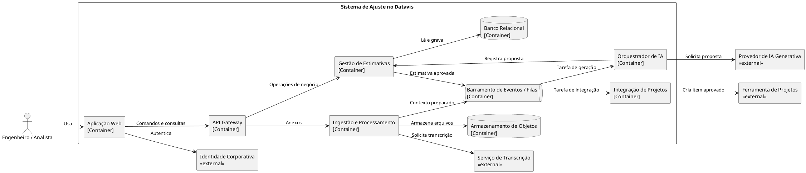

# Resposta 1 — Descrição geral

## 1. Fatos informados

- O sistema apoia o ajuste de estimativas de demandas de dados no Datavis.
- O usuário registra contexto e pode incluir documentos, planilhas, imagens, áudios e vídeos.
- A IA Generativa propõe jornadas, atividades, premissas e T-shirt sizing.
- O sistema calcula uma visão financeira usando a estimativa e parâmetros de custo.
- Um engenheiro revisa e decide sobre a proposta.
- Após aprovação, a demanda é enviada a uma ferramenta corporativa de projetos.
- O sistema deve manter histórico, status e rastreabilidade.
- A solução não executa pipelines nem realiza deploy.

## 2. Lacunas arquiteturais

| # | Lacuna | Impacto possível |
|---|---|---|
| 1 | Identidade e perfis de acesso não definidos | Altera autenticação, autorização e trilha de auditoria. |
| 2 | Ferramenta de gestão de projetos não definida | Altera contrato, autenticação e tratamento de falhas da integração. |
| 3 | Hospedagem e modelo da IA não definidos | Altera privacidade, latência, custo e operação. |
| 4 | Tratamento de áudio, vídeo e imagens não definido | Altera serviços auxiliares, formatos e processamento. |
| 5 | Volumetria e tamanho máximo dos anexos desconhecidos | Altera armazenamento, filas, limites e escalabilidade. |
| 6 | Requisitos de segurança e classificação da informação ausentes | Altera anonimização, criptografia, retenção e acesso. |
| 7 | Regra de cálculo financeiro incompleta | Altera domínio, versionamento e auditabilidade dos parâmetros. |
| 8 | Critérios de aprovação e reprocessamento indefinidos | Altera máquina de estados e comportamento em falhas. |
| 9 | SLA, observabilidade e suporte não definidos | Altera topologia operacional, alertas e resiliência. |

## 3. Perguntas de esclarecimento

| # | Pergunta | Por que altera a arquitetura? |
|---|---|---|
| 1 | Qual sistema corporativo receberá a demanda aprovada? | Define o adaptador, o modelo de autenticação e os limites da integração. |
| 2 | A LLM será pública, privada ou híbrida? | Muda controles de dados, conectividade, custo e operação. |
| 3 | Quais tipos, tamanhos e volumes de anexos serão aceitos? | Dimensiona armazenamento, filas e workers. |
| 4 | Áudio e vídeo precisam ser transcritos? Imagens exigem OCR? | Determina o pipeline de extração e os serviços auxiliares. |
| 5 | Quais dados são pessoais, sensíveis ou confidenciais? | Define minimização, anonimização, retenção e auditoria. |
| 6 | Como as jornadas e os custos são calculados e versionados? | Define regras de domínio e reprodutibilidade das estimativas. |
| 7 | Quem pode editar, aprovar, rejeitar ou reenviar uma estimativa? | Determina RBAC, estados e segregação de funções. |
| 8 | Qual prazo de resposta e disponibilidade são esperados? | Orienta a necessidade de processamento síncrono/assíncrono e redundância. |

## 4. Hipóteses para a primeira modelagem

As hipóteses abaixo permitem produzir um modelo inicial, mas precisam de validação:

- interface web para engenheiros e analistas;
- API Gateway como ponto único de entrada;
- banco relacional para demandas, estimativas e auditoria;
- armazenamento de objetos para anexos;
- processamento assíncrono por barramento de eventos ou filas;
- serviço externo de transcrição para áudio e vídeo;
- provedor genérico de IA Generativa;
- adaptador genérico para a ferramenta corporativa de projetos;
- autenticação corporativa, sem produto definido.

## 5. Roteiro técnico revisado

### Objetivo

Dar suporte à elaboração de estimativas de demandas de dados, convertendo contexto não estruturado em uma proposta revisável e rastreável.

### Fluxo principal

1. O usuário cria uma demanda e inclui contexto e anexos.
2. O sistema persiste metadados e arquivos.
3. O processamento extrai ou transcreve conteúdo e publica o contexto consolidado.
4. O orquestrador prepara o prompt e solicita uma proposta à IA.
5. O serviço de estimativas aplica as regras de cálculo financeiro e grava a versão.
6. O usuário revisa, altera e aprova ou rejeita a estimativa.
7. Se aprovada, a integração registra a demanda na ferramenta corporativa e salva a referência externa.

### Dentro do escopo

- cadastro, edição e consulta de demandas;
- upload, armazenamento e processamento de anexos;
- geração assistida por IA;
- T-shirt sizing e cálculo financeiro;
- revisão e aprovação humana;
- histórico, auditoria e integração com gestão de projetos.

### Fora do escopo

- execução ou deploy de pipelines;
- alteração automática de ambientes de dados;
- aprovação autônoma pela IA;
- gestão do ciclo de desenvolvimento após a criação do item externo.

## 6. Diagrama C4 — Containers

Fonte independente: [`../diagramas/Diagrama1Containers.puml`](../diagramas/Diagrama1Containers.puml).

O arquivo `.puml` indicado contém a mesma arquitetura com estilos, descrições e legenda completos.

## 7. Decisões bloqueadas

- Produto e topologia de autenticação.
- Produto do Message Broker.
- Tecnologia de persistência e armazenamento.
- Provedor e modelo da IA.
- Ferramenta corporativa de projetos.
- SLA, retenção e recuperação de desastre.

## 8. Checklist para Pull Request

- [ ] O diagrama permanece no nível de Containers, sem classes, métodos ou endpoints?
- [ ] Pessoas, sistema em foco e sistemas externos estão visualmente diferenciados?
- [ ] Cada container possui responsabilidade única e descrição clara?
- [ ] Todas as relações têm direção e propósito explícitos?
- [ ] Tecnologias ainda não decididas aparecem como hipóteses, não como fatos?
- [ ] O processamento assíncrono e as dependências externas estão visíveis?
- [ ] A aprovação humana ocorre antes do envio à ferramenta de projetos?
- [ ] Dados sensíveis não aparecem em nomes, exemplos ou anotações?
- [ ] O diagrama está consistente com o roteiro e com os limites de escopo?
- [ ] O código PlantUML compila e a imagem permanece legível?
