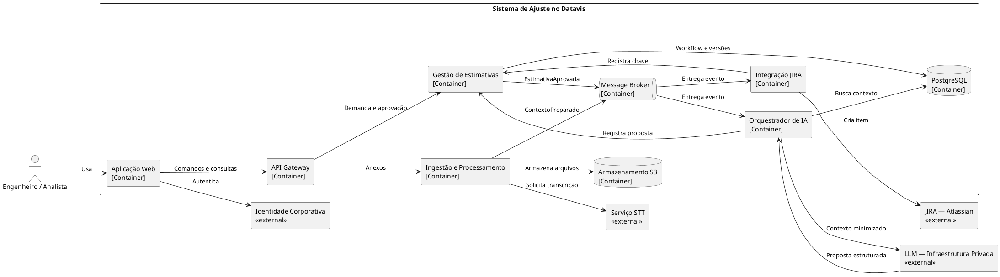
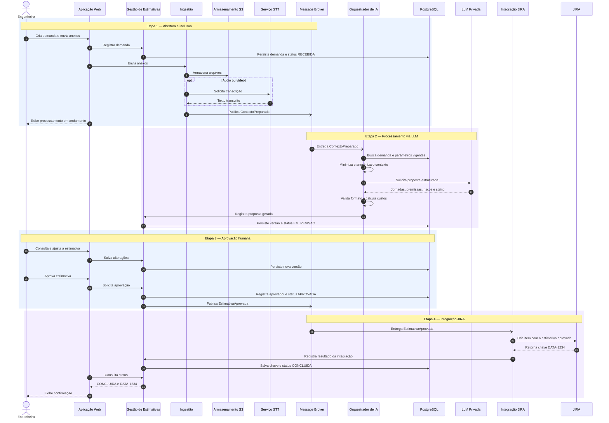

# Resposta 2 — Refinamento

## 1. Alterações em relação ao primeiro modelo

| Elemento | Modelo inicial | Modelo refinado |
|---|---|---|
| Gestão de projetos | Ferramenta genérica | JIRA (Atlassian) |
| IA Generativa | Provedor não definido | LLM em infraestrutura privada |
| Dados estruturados | Banco relacional genérico | PostgreSQL |
| Anexos | Armazenamento de objetos genérico | Armazenamento compatível com S3 |
| Processamento | Barramento/filas genérico | Message Broker, produto ainda não definido |
| Mídias | Transcrição como hipótese | Serviço STT confirmado |
| Proteção de dados | Lacuna | Minimização e anonimização antes da LLM |
| Decisão final | Revisão humana | Aprovação humana obrigatória |
| Integração | Envio genérico | Criação no JIRA e registro da chave retornada |

## 2. Arquitetura refinada

### Responsabilidades

- **Aplicação Web:** cria demandas, envia anexos, acompanha status e apresenta a proposta para revisão.
- **API Gateway:** controla a entrada e encaminha as solicitações aos serviços internos.
- **Serviço de Gestão de Estimativas:** mantém demanda, versões, estados, jornadas, custos, aprovação e histórico.
- **Serviço de Ingestão e Processamento:** valida anexos, armazena objetos, extrai texto e coordena transcrição.
- **Orquestrador de IA:** consolida o contexto, minimiza e anonimiza dados, monta o prompt, chama a LLM e valida a resposta estruturada.
- **Serviço de Integração JIRA:** converte a estimativa aprovada no contrato esperado pelo JIRA, cria o item e registra a chave retornada.
- **Message Broker:** desacopla ingestão, processamento, geração e integração.
- **PostgreSQL:** persiste dados estruturados, versões, estados e auditoria.
- **Armazenamento S3:** persiste documentos e mídias.
- **Serviço STT:** transcreve áudio e vídeo.
- **LLM Privada:** produz a proposta de estimativa a partir de contexto minimizado.
- **JIRA:** recebe exclusivamente a estimativa aprovada.

## 3. Diagrama C4 — Containers atualizado

Fonte: [`../diagramas/Diagrama2Containers.puml`](../diagramas/Diagrama2Containers.puml).

O arquivo `.puml` indicado contém a mesma arquitetura com estilos, descrições e legenda completos.

## 4. Diagrama de sequência

Fonte: [`../diagramas/DiagramaSequencia.mmd`](../diagramas/DiagramaSequencia.mmd).

## 5. Estados mínimos da demanda

`RASCUNHO → RECEBIDA → EM_PROCESSAMENTO → EM_REVISAO → APROVADA → EM_INTEGRACAO → CONCLUIDA`

Estados de exceção recomendados: `REJEITADA`, `FALHA_PROCESSAMENTO` e `FALHA_INTEGRACAO`. A política de retentativa continua pendente.

## 6. Decisões ainda pendentes

- provedor de identidade, RBAC e segregação de funções;
- produto e topologia do Message Broker;
- produto compatível com S3 e políticas de retenção;
- tecnologia do serviço STT e tratamento de idiomas;
- contrato de saída estruturada da LLM e estratégia de versionamento de prompts;
- regra oficial para jornadas, custos e validade dos parâmetros;
- limites de arquivo, volumetria, SLA e disponibilidade;
- estratégia de retentativa, idempotência e fila de mensagens não processadas;
- requisitos de backup, recuperação, monitoramento e suporte.

## 7. Riscos residuais e controles sugeridos

| Risco | Controle sugerido |
|---|---|
| Resposta incorreta ou inconsistente da LLM | Saída estruturada, validação determinística e aprovação humana. |
| Exposição de informação confidencial | Classificação, minimização, anonimização, criptografia e controle de acesso. |
| Duplicidade de itens no JIRA | Chave de idempotência por versão aprovada. |
| Falha silenciosa em fluxo assíncrono | Correlação, métricas, logs, alertas e fila de mensagens não processadas. |
| Estimativa irreproduzível | Versionar prompt, modelo, parâmetros de custo, entradas e saída. |
| Arquivo malicioso ou formato inválido | Validação de tipo/tamanho e verificação antimalware antes do processamento. |
